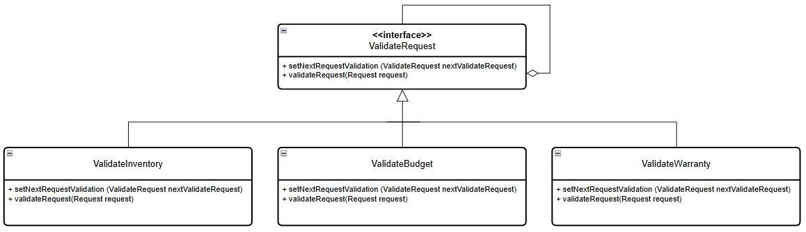

# Application of the Chain Of Responsibility behavioral pattern

Chain of Responsibility is a behavioral design pattern that allows passing requests through a chain of controllers. Upon receiving a request, each controller decides whether to process it or pass it to the next controller in the chain.

In the following example it is applied as follows:
* A product purchase requisition is required to be made.
* First you must verify that there are less than 10 products in inventory of the requested product.
* Then verify that the estimated cost does not exceed the business budget.
* And finally you must verify that the supplier offers warranty.

If at any time any step is not complied with, you must notify that it was rejected and the reason.

If it passes all the validations, you must inform that the request was approved.

